# [IMS-018] Quản lý tài khoản

> Chuyển từ `[IMS-018] Quản lý tài khoản.docx`. Hình minh họa nằm ở `docs/srs/assets/IMS-018/`.

## 1. Giới thiệu

### 1.1. Mục đích

Chức năng Quản lý tài khoản đảm bảo công tác quản trị định danh toàn hệ thống. Chức năng này được triển khai đồng bộ trên hai hệ thống con là IMS và DSS với phạm vi thẩm quyền được thiết kế riêng biệt cho từng nhóm đối tượng người dùng:

Hệ thống IMS (Hệ thống dành cho người dùng nội bộ): Đóng vai trò là trung tâm quản trị tập trung. Tại phân hệ này, quản trị viên nội bộ có quyền quản lý toàn diện đối với cả hai nhóm đối tượng: tài khoản của lãnh đạo, chuyên viên nội bộ và tài khoản của các cá nhân thuộc tổ chức bên ngoài tham gia vào hệ thống.

Hệ thống DSS (Hệ thống dành cho người dùng bên ngoài): Chức năng quản lý tài khoản tại đây được giới hạn trong phạm vi nội bộ của từng đơn vị: người dùng đại diện của tổ chức bên ngoài chỉ có quyền thiết lập và quản lý các tài khoản thuộc chính tổ chức của mình, đảm bảo tính chủ động và độc lập dữ liệu giữa các bên.

### 1.2. Danh sách tác nhân

| STT | Mã tác nhân | Tên tác nhân | Hệ thống sử dụng | Mô tả tác nhân |
| --- | --- | --- | --- | --- |
| 1 | ADMIN_HT | Admin hệ thống | IMS | Quản trị viên hệ thống ICDS, có toàn quyền quản trị tài khoản |
| 2 | ADMIN_NY | Chuyên viên Phòng niêm yết | IMS | Cán bộ nghiệp vụ HNX thuộc Phòng Niêm yết, có quyền quản trị những tài khoản thuộc phòng niêm yết và tổ chức bên ngoài |
| 3 | ADMin_TC | Chuyên viên Phòng trái phiếu | IMS | Cán bộ nghiệp vụ HNX thuộc Phòng Trái phiếu, có quyền quản trị những tài khoản thuộc phòng trái phiếu và tổ chức bên ngoài |
| 4 | CV_TC | Admin tổ chức | DSS | Quản trị viên thuộc tổ chức bên ngoài, có quyền khởi tạo và quản lý các tài khoản người dùng thuộc nội bộ chính tổ chức đó. |
| 5 | LDAP | LDAP |  | Nguồn lưu trữ tài khoản người dùng nội bộ gốc, phục vụ đồng bộ dữ liệu người dùng về CSDL Oracle của hệ thống ICDS. |
| 6 | KEYCLOAK | KEYCLOAK | IMS-DSS | Quản lý xác thực tập trung, cấp phát Token, phát sự kiện Webhook (SPI) và cung cấp Admin API để đồng bộ và xác thực tài khoản người dùng. |

Bảng 01: Danh sách tác nhân

### 1.3. Chức năng

#### 1.3.1. Danh sách chức năng

| STT | Tên chức năng | Hệ thống sử dụng | Mô tả chức năng | Phân loại yêu cầu chức năng |
| --- | --- | --- | --- | --- |
| 1 | Tìm kiếm / Xem danh sách tài khoản | IMS | Cho phép Admin hệ thống/Chuyên viên tìm kiếm tài khoản theo Tên tài khoản, Họ tên, Loại tài khoản, Phòng ban, Vai trò, Trạng thái ở IMS | Yêu cầu truy vấn |
|  |  | DSS | Cho phép User tổ chức tìm kiếm tài khoản theo Tên tài khoản, Họ tên, Loại tài khoản, Phòng ban, Vai trò, Trạng thái ở IMS và DSS | Yêu cầu truy vấn |
| 2 | Thêm mới/ chỉnh sửa tài khoản nội bộ | IMS | Admin hệ thống/Chuyên viên khai báo và tạo mới tài khoản cho cán bộ HNX trên IMS | Dữ liệu đầu vào |
| 3 | Thêm mới/ chỉnh sửa tài khoản bên ngoài | IMS | Người dùng nội bộ khai báo và tạo mới tài khoản cho user tổ chức trên IMS | Dữ liệu đầu vào |
|  |  | DSS | User tổ chức khai báo và tạo mới tài khoản cho cán bộ trong tổ chức và nhà đầu tư trên DSS | Dữ liệu đầu vào |
| 4 | Đăng ký chuyên trang trên DSS và phê duyệt trên IMS | IMS | User HNX phê duyệt qua trang “phê duyệt đăng ký” để thông tin chuẩn sang trạng thái “ tạm lưu” ở Danh mục hồ sơ | Dữ liệu đầu vào |
|  |  | DSS | User tổ chức tự đăng ký tài khoản qua cổng DSS | Dữ liệu đầu vào |
| 5 | Reset mật khẩu | IMS | User HNX thay đổi mật khẩu cho người dùng; thông tin xác thực mới gửi qua Email | Dữ liệu đầu vào |
|  |  | DSS | User tổ chức thay đổi mật khẩu cho người dùng; thông tin xác thực mới gửi qua Email | Dữ liệu đầu vào |
| 6 | Thay đổi mật khẩu lần đầu tiên | IMS | Người dùng thay đổi mật khẩu lần đầu tiên sau khi được tạo mới tài khoản hoặc được reset mật khẩu | Dữ liệu đầu vào |
|  |  | DSS | Người dùng thay đổi mật khẩu lần đầu tiên sau khi được tạo mới tài khoản hoặc được reset mật khẩu | Dữ liệu đầu vào |
| 7 | Đăng nhập một lần (SSO) | IMS, DSS | Cho phép người dùng xác thực tập trung qua Keycloak; sau khi đăng nhập thành công có thể truy cập chuyển đổi qua lại giữa các hệ thống liên kết mà không cần đăng nhập lại. | Yêu cầu hệ thống / Yêu cầu bảo mật |
| 8 | Đồng bộ dữ liệu | IMS | Toàn bộ danh sách tài khoản người dùng đã có sẵn từ trước tại LDAP db sẽ được nạp vào bảng trong cơ sở dữ liệu Oracle của ICDS. |  |
| 9 | Xác thực bảo mật 2 lớp | IMS, DSS | Yêu cầu users thực hiện bước xác thực thứ 2 sau khi đăng nhập thành công. Hệ thống trung gian Keycloak đứng ra điều phối các phương thức xác thực: Google Authenticator (GA): Nhập mã OTP ngẫu nhiên theo thời gian sinh ra từ ứng dụng Google Authenticator Chữ ký số (CA): Xác thực thông qua Chứng thư số do các tổ chức CA hợp lệ cấp. SMS OTP: Nhận và nhập mã xác thực OTP gửi qua tin nhắn SMS về số điện thoại chính chủ đã đăng ký trên hệ thống. | Yêu cầu bảo mật |

Bảng 02: Danh sách chức năng

#### 1.3.2. Sơ đồ luồng (sequence diagram)

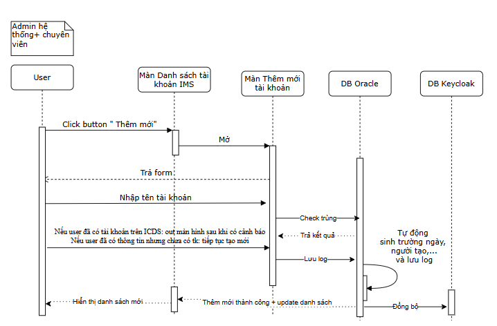

Sơ đồ luồng 1.1: Thêm mới/ chỉnh sửa tài khoản nội bộ IMS

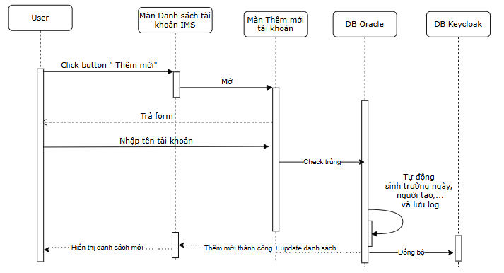

Sơ đồ luồng 1.2: Thêm mới/ chỉnh sửa tài khoản bên ngoài IMS

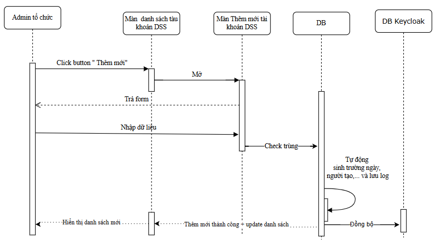

Sơ đồ 02: Thêm mới/ chỉnh sửa tài khoản bên ngoài trên DSS

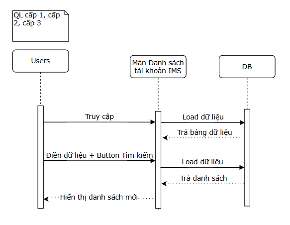

                                                                                           Sơ đồ luồng 3.1: Tìm kiếm / xem danh sách tài khoản IMS

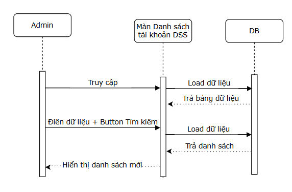

                                                                     Sơ đồ luồng 3.2: Tìm kiếm / xem danh sách tài khoản DSS

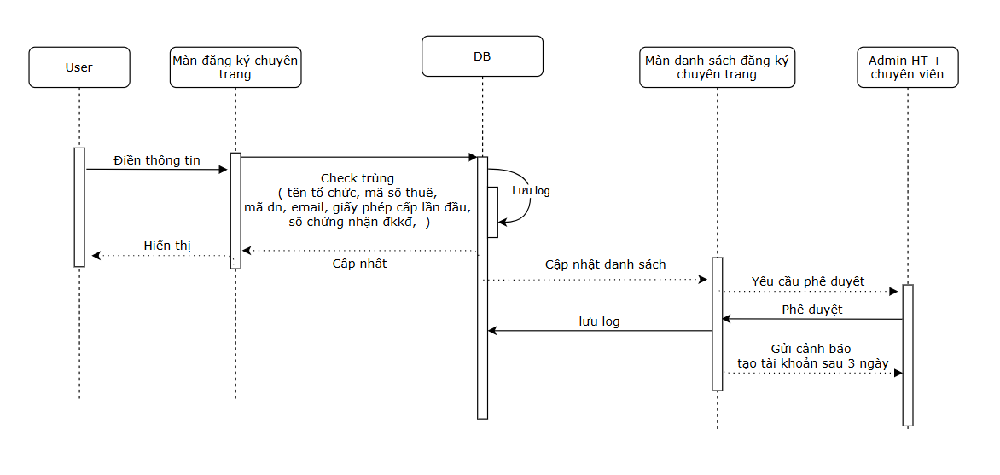

Sơ đồ 04: Đăng ký chuyên trang

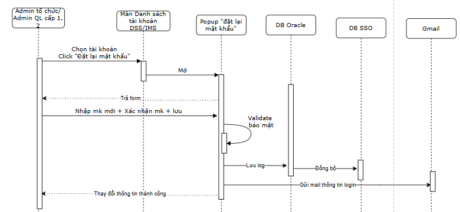

Sơ đồ 05: Reset mật khẩu ( luồng admin reset người dùng khác )

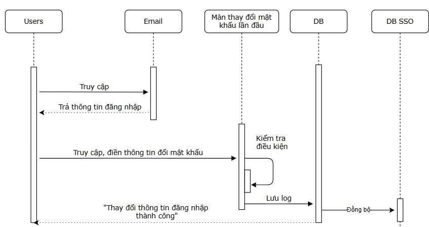

Sơ đồ 06: Thay đổi mật khẩu lần đầu

## 2. Đặc tả màn hình (Screen specification)

### 2.1. Danh sách màn hình

Đường dẫn menu: Quản lý hệ thống → Quản lý tài khoản

| STT | Mã màn hình | Tên màn hình | Loại | Mục đích sử dụng |
| --- | --- | --- | --- | --- |
| 1 | IMS-018-1.1 | Danh sách tài khoản nội bộ IMS | List View | Tìm kiếm, tra cứu và hiển thị danh sách các tài khoản người dùng nội bộ trong hệ thống IMS. |
| 2 | IMS-018-1.2 | Danh sách tài khoản tổ chức IMS | List View | Tìm kiếm, tra cứu và hiển thị danh sách các tài khoản thuộc các tổ chức trên hệ thống IMS. |
| 3 | IMS-018-1.3 | Danh sách tài khoản tổ chức DSS | List View | Quản lý, tra cứu và hiển thị danh sách các tài khoản thuộc tổ chức cụ thể dành cho Admin tổ chức trên hệ thống DSS. |
| 4 | IMS-018-1.4 | Xem lịch sử thay đổi tài khoản IMS+DSS | Popup / Modal | Hiển thị chi tiết nhật ký/lịch sử cập nhật thông tin tài khoản (thời gian, người thực hiện, trường dữ liệu, giá trị cũ và mới). |
| 5 | IMS-018-2.1 | Popup Thêm mới/Cập nhật tài khoản nội bộ IMS | Popup / Form nhập liệu | Khai báo hoặc cập nhật thông tin chi tiết cho tài khoản người dùng nội bộ hệ thống IMS. |
| 6 | IMS-018-2.2 | Popup Thêm mới/Cập nhật tài khoản tổ chức IMS | Popup / Form nhập liệu | Khai báo hoặc cập nhật thông tin chi tiết cho tài khoản đại diện tổ chức trên hệ thống IMS. |
| 7 | IMS-018-3 | Màn hình thêm mới tài khoản (DSS) | Popup / Form nhập liệu | Khai báo và thêm mới thông tin tài khoản người dùng cho tổ chức trên hệ thống DSS. |
| 8 | IMS-018-4.1 Đến IMS-018-4.4 | Đăng ký/ phê duyệt chuyên trang (Bước 1 đến bước 4): | Form nhập liệu | Nhập các thông tin cơ bản của tổ chức trong quy trình đăng ký chuyên trang (link gắn vào DSS). |
| 9 | IMS-018-5 | Phê duyệt chuyên trang IMS | Listview | Tra cứu danh sách hồ sơ đăng ký tài khoản chuyên trang và thực hiện thao tác phê duyệt hoặc từ chối hồ sơ. |
| 10 | IMS-018-6.1 | Tạo mật khẩu mới cho người dùng | Popup / Form chức năng | Đặt lại mật khẩu (tự nhập hoặc hệ thống tự sinh) và gửi email thông tin đăng nhập cho người dùng. |
| 11 | IMS-018-6.2 | Người dùng tự đặt lại mật khẩu | Popup / Form chức năng | Cho phép cá nhân người dùng tự đổi mật khẩu đăng nhập cá nhân (yêu cầu nhập mật khẩu hiện tại, mật khẩu mới và xác nhận). |
| 12 | IMS-018-7 | Thay đổi mật khẩu lần đầu | Popup / Form chức năng | Người dùng thay đổi mật khẩu lần đầu tiên sau khi được tạo tài khoản hoặc mật khẩu được thay đổi do admin |
| 12 | IMS-018-8 | Widget thông báo nhắc phê duyệt hồ sơ và tạo tài khoản | Widget / Bảng thông báo | Thống kê số lượng tổ chức chưa tạo tài khoản, nhắc nhở và cung cấp lối tắt thực hiện tạo tài khoản/phê duyệt hồ sơ nhanh. |

Bảng 03: Danh sách các màn hình

### 2.2. Màn hình Danh sách tài khoản

#### 2.2.1. Màn hình

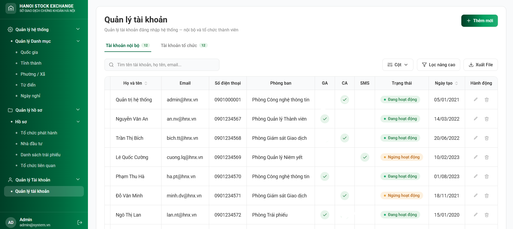

Màn hình 1.1: Danh sách tài khoản nội bộ IMS

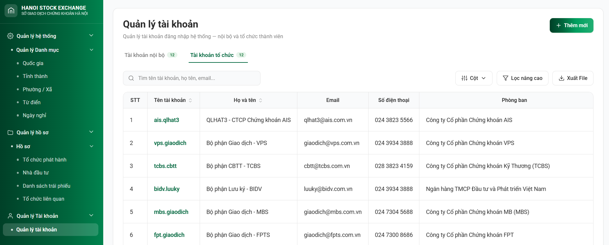

Hình 1.2: Danh sách tài khoản tổ chức IMS

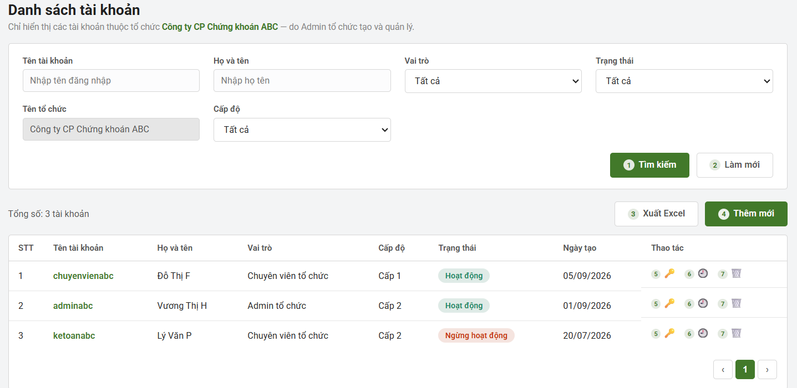

Hình 1.3: Danh sách tài khoản tổ chức DSS

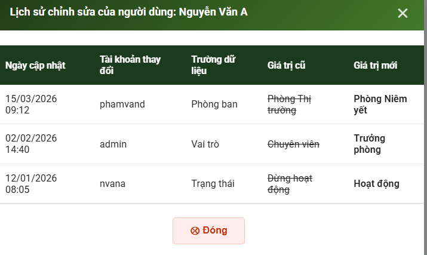

Hình 1.4: Xem lịch sử thay đổi tài khoản IMS+DSS

#### 2.2.2. Mô tả

| STT | Thành phần | Tên (Việt) | Tên (Anh) | Bảng | Trường | Kiểm tra logic | Ràng buộc |
| --- | --- | --- | --- | --- | --- | --- | --- |
| **Danh sách tài khoản IMS** |  |  |  |  |  |  |  |
| 1 | Label | Danh sách tài khoản | Account List |  |  | Hiển thị tiêu đề trang/màn hình quản lý tài khoản. | Read-only |
| 2 | Textbox | Tìm kiếm theo họ tên, emails, … | Username | LOGINS | NAME | Tìm kiếm tương đối theo tên đăng nhập, email và các giá trị khác trong bảng |  |
| 4 | Tab | Tài khoản nội bộ | Internal Users | LOGINS | TYPE | Lọc user_type = 'Nội bộ'. - Admin hệ thống: Hiện toàn bộ tài khoản và đầy đủ cột. - Admin chuyên viên: Lọc theo phòng ban user đang đăng nhập + Phòng Niêm yết: department = 'Niêm yết' + Phòng Thị trường: department = 'Thị trường' + Phòng Trái phiếu: department = 'Trái phiếu' | Mặc định chọn khi vào màn hình. |
| 5 | Tab | Tài khoản tổ chức | Outer Users |  | TYPE | Lọc user_type = 'EXTERNAL'. Hiển thị đầy đủ danh sách nếu user đăng nhập được phân quyền xem. |  |
| 8 | Button | Tìm kiếm | Search |  |  | Kích hoạt truy vấn lọc dữ liệu danh sách theo các điều kiện trên form. |  |
| 9 | Button | Làm mới | Refresh |  |  | Xóa các điều kiện lọc về mặc định và tải lại danh sách ban đầu. |  |
| 10 | Button | Thêm mới | Add new |  |  | Mở popup tạo mới tài khoản. |  |
| 11 | Button | Xuất Excel | Export |  |  | Xuất toàn bộ dữ liệu danh sách đang lọc ra file Excel (.xlsx). | Xuất theo điều kiện đang lọc |
| 12 | Grid Column | STT | No |  |  | Hiển thị số thứ tự bản ghi tăng dần theo phân trang. | Tự động sinh, Không rỗng. |
| 13 | Grid Column | Tên tài khoản | Account | LOGINS | NAME | Hiển thị tên đăng nhập của tài khoản. Gán với Hyperlink đến phần chi tiết tài khoản ( có thể chỉnh sửa ) | Unique, Không rỗng. |
| 14 | Grid Column | Họ tên | Full Name | LOGINS | FULLNAME | Hiển thị họ và tên đầy đủ của người dùng. |  |
| 16 | Grid Column | Phòng ban | Department | LOGINS | DEPARTMENT | Hiển thị tên phòng ban trực thuộc của tài khoản. |  |
| 17 | Grid Column | Vai trò | Role | LOGINS | ROLE | Hiển thị tên vai trò được gán cho tài khoản. |  |
| 18 | Grid Column | Cấp độ | Level | LOGINS | LEVEL | Hiển thị cột cấp độ ở cả tab  nội bộ và bên ngoài |  |
| 19 | Grid Column | GA | GA | LOGINS | GA | Nếu được chọn trong phần tạo mới, trong danh sách: GA=” đăng ký”,else = “không đăng ký” |  |
| 20 | Grid Column | CA | CA | LOGINS | CA | Nếu được chọn trong phần tạo mới, trong danh sách: CA=” đăng ký”,else = “không đăng ký” |  |
| 20 | Grid Column | SMS | SMS | LOGINS | SMS | Nếu được chọn trong phần tạo mới, trong danh sách: SMS=” đăng ký”,else = “không đăng ký” |  |
| 21 | Grid Column | Trạng thái | Status | LOGINS | STATUS | Hiển thị trạng thái hiện tại (1: Hoạt động, 0: Dừng hoạt động). | . |
| 22 | Grid Column | Ngày tạo | Created Date | LOGINS | CREATE_DATE | Hiển thị ngày giờ tài khoản được khởi tạo. | Định dạng DD/MM/YYYY |
| 23 | Action link ( 7) | Xóa | Edit |  |  | Xóa bản ghi |  |
| 25 | Action link (5) | Đặt lại mật khẩu | Password Reset |  |  | Mở popup đặt lại mật khẩu |  |
| 25 | Action link (6) | Xem lịch sử | Log |  |  | Mở popup xem lịch sử |  |
| **Danh sách tài khoản DSS** |  |  |  |  |  |  |  |
| 1 | Label | Danh sách tài khoản | Account List |  |  | Hiển thị tiêu đề trang/màn hình quản lý tài khoản. | Read-only |
| 2 | Textbox | Tìm kiếm theo họ tên, emails, … | Username | LOGINS | NAME | Tìm kiếm tương đối theo tên đăng nhập, email và các giá trị khác trong bảng |  |
| 3 | Textbox | Họ và tên | Full name |  |  | Tìm kiếm tương đối theo họ và tên đầy đủ |  |
|  | Textbox | Tên tổ chức | Org name |  |  | Cố định tên tổ chức là tổ chức của tàu khoản đang truy cập, tức là tài khoản tổ chức chỉ được tạo mới và xem sửa xóa tài khoản thuộc tổ chức đó |  |
| 6 | Dropdown | Vai trò | Role |  |  | Lọc danh sách tài khoản theo vai trò được chọn. | Mặc định: "Tất cả". |
| 7 | Dropdown | Trạng thái | Status |  |  | Lọc danh sách theo trạng thái tài khoản (Hoạt động / ngừng hoạt động). | Mặc định: "Tất cả". |
| 8 | Button | Tìm kiếm | Search |  |  | Kích hoạt truy vấn lọc dữ liệu danh sách theo các điều kiện trên form. |  |
| 9 | Button | Làm mới | Refresh |  |  | Xóa các điều kiện lọc về mặc định và tải lại danh sách ban đầu. |  |
| 10 | Button | Thêm mới | Add new |  |  | Mở popup tạo mới tài khoản. |  |
| 11 | Button | Xuất Excel | Export |  |  | Xuất toàn bộ dữ liệu danh sách đang lọc ra file Excel (.xlsx). | Xuất theo điều kiện đang lọc |
| 12 | Grid Column | STT | No |  |  | Hiển thị số thứ tự bản ghi tăng dần theo phân trang. | Tự động sinh, Không rỗng. |
| 13 | Grid Column | Tên tài khoản | Account | LOGINS | LOGIN_NAME | Hiển thị tên đăng nhập của tài khoản. | Unique, Không rỗng. |
| 14 | Grid Column | Họ tên | Full Name | LOGINS | FULLNAME | Hiển thị họ và tên đầy đủ của người dùng. |  |
| 17 | Grid Column | Vai trò | Role | LOGINS | ROLE | Hiển thị tên vai trò được gán cho tài khoản. |  |
| 19 | Grid Column | Cấp độ | Level | LOGINS | LEVEL | Hiển thị 2 cấp độ của tổ chức |  |
| 20 | Grid Column | Trạng thái | Status | LOGINS | STATUS | Hiển thị trạng thái hiện tại (1: Hoạt động, 0: Dừng hoạt động). | . |
| 21 | Grid Column | Ngày tạo | Created Date | LOGINS | CREATE_DATE | Hiển thị ngày giờ tài khoản được khởi tạo. | Định dạng DD/MM/YYYY |
| 22 | Action link | Sửa | Edit | LOGINS |  | Mở màn hình chỉnh sửa tài khoản |  |
| 23 | Action link | Đặt lại mật khẩu | Password Reset | LOGINS |  | Mở popup đặt lại mật khẩu |  |

Bảng 04: Mô tả màn hình "Danh sách tài khoản"

### 2.3. Popup: Thêm mới/Cập nhật tài khoản IMS

#### 2.3.1. Màn hình

Thêm mới: từ màn hình Danh sách tài khoản → bấm "+ Thêm mới".  Cập nhật: chọn dòng cần sửa → Click [Tên tài khoản cần sửa] .

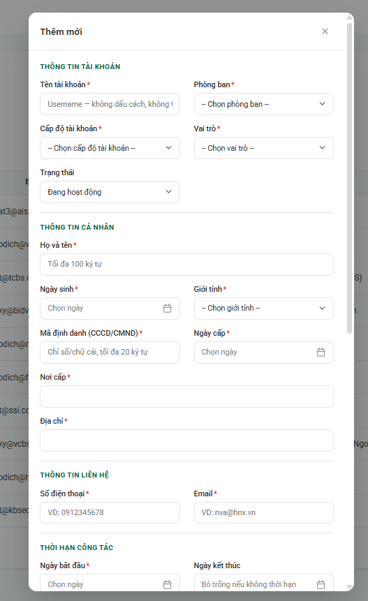

Hình 2.1: Popup Thêm mới/Cập nhật tài khoản nội bộ IMS

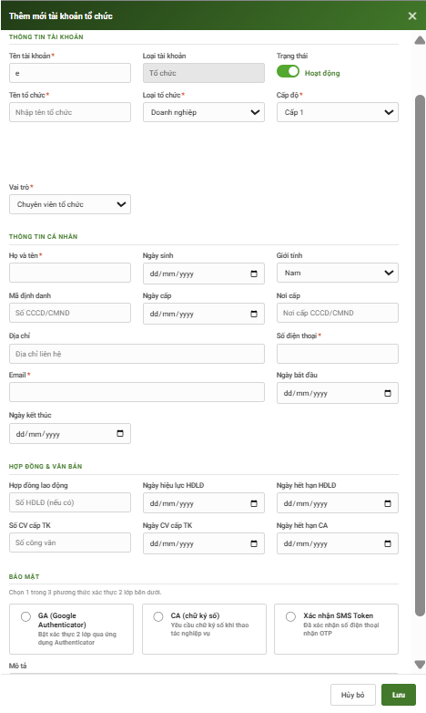

Hình 2.2: Popup Thêm mới/Cập nhật tài khoản tổ chức IMS

#### 2.3.2. Mô tả

| STT | Thành phần | Tên (Việt) | Tên (Anh) | Bảng | Trường | Kiểm tra logic | Ràng buộc |
| --- | --- | --- | --- | --- | --- | --- | --- |
| **Màn Tạo mới Tài khoản nội bộ** |  |  |  |  |  |  |  |
| 1 | Label | Thêm mới/cập nhật | New/Edit |  |  |  | Read-only. |
| 2 | Textbox | Tên tài khoản | Username | LOGINS | NAME | - Check trùng lặp (Unique) trong hệ thống. - Không chứa khoảng trắng - Không thay đổi khi cập nhật | Bắt buộc nhập. |
| 3 | Dropdown | Loại tài khoản | Account type | LOGINS | TYPE | Cố định Loại tài khoản= “ nội bộ “ |  |
| 4 | Dropdown | Phòng ban | Department | LOGINS | DEPARTMENTS | Tự động lấy phòng ban của User đang đăng nhập (người tạo) và gán cố định vào trường này. ( Phòng ban nào chỉ được tạo tài khoản của phòng ban đó ) | Bắt buộc. Read-only/Disable (Không cho phép đổi). |
| 5 | Dropdown | Cấp độ tài khoản | Account level | LOGINS | LEVEL | 3 phòng Niêm yết, CNTT, tHỊ TRƯỜNG chỉ hiện cấp 1. Riêng Phòng trái phiếu có 3 cấp: Level 1 (Admin) được tạo và cấp tất cả các level Tạo & Cấp quyền: tài khoản nội bộ TP L2, L3). Level 2: Chỉ được cấp: Tạo & Cấp quyền: tk nội bộ TP level 3, Level 3 - Phân quyền theo nhóm: Không có quyền tạo, cấp quyền hoặc đổi trạng thái tài khoản khác. Chỉ được xem | Bắt buộc chọn. |
| 6 | Dropdown | Vai trò | Role | LOGINS | ROLE |  | Bắt buộc chọn. |
| 8 | Textbox | Họ và tên | Full name | LOGINS | FULL_NAME |  | Bắt buộc nhập. Tối đa 100 ký tự. |
| 9 | Datepicker | Ngày sinh | Date of birth | LOGINS | BIRTH_DATE | Ngày sinh < Ngày hiện tại. | Bắt buộc nhập. Format: DD/MM/YYYY. |
| 10 | Dropdown | Giới tính | Gender | LOGINS | SEX |  | Bắt buộc chọn. |
| 11 | Textbox | Mã định danh | ID number | LOGINS | RESIDENT_ID |  | Bắt buộc nhập. Chỉ chứa số/chữ cái, tối đa 20 ký tự. |
| 12 | Datepicker | Ngày cấp | Issue date | LOGINS | RESIDENT_ID_DATE | Ngày cấp <= Ngày hiện tại Ngày cấp >= Ngày sinh. | Bắt buộc nhập. |
| 13 | Textbox | Nơi cấp | Issue place | LOGINS | RESIDENT_ID_PLACE |  | Bắt buộc nhập. |
| 14 | Textbox | Địa chỉ | Address | LOGINS | ADDRESS | - | Bắt buộc nhập. |
| 15 | Textbox | Số điện thoại | Phone | LOGINS | TEL | Check trùng SĐT | Bắt buộc nhập. |
| 16 | Textbox | Email | Email | LOGINS | EMAIL | Check trùng email. | Bắt buộc nhập. |
| 17 | Datepicker | Ngày bắt đầu | Start date | LOGINS | START_DATE | Nếu có Ngày kết thúc: Ngày bắt đầu <= Ngày kết thúc. | Bắt buộc nhập. Format: DD/MM/YYYY. |
| 18 | Datepicker | Ngày kết thúc | End date | LOGINS | END_DATE | Ngày kết thúc >= Ngày bắt đầu. | Tùy chọn (Có thể bỏ trống nếu không thời hạn). |
| 19 | Textbox | Hợp đồng lao động | Labor contract no. | LOGINS | LABOR_CONTRACT |  | Không bắt buộc |
| 20 | Datepicker | Ngày hiệu lực HĐLĐ | Contract effective date | LOGINS | LABOR_CONTRACT_START_DATE |  |  |
| 21 | Datepicker | Ngày hết hạn HĐLĐ | Contract expire date | LOGINS | LABOR_CONTRACT_END_DATE |  |  |
| 22 | Textbox | Số CV cấp TK | Approval doc no. | LOGINS | APPROVAL_DOC_NO |  |  |
| 23 | Datepicker | Ngày CV cấp TK | Approval doc date | LOGINS | APPROVAL_DOC_DATE |  |  |
| 24 | Datepicker | Ngày hết hạn CA | CA expire date | LOGINS | CA_EXPIRE_DATE |  |  |
| 25 | Checkbox/Toggle | GA (Google Authenticator) | GA flag | LOGINS | GA | Chỉ được lựa chọn 1/3 phương thức |  |
| 26 | Checkbox/Toggle | CA (chữ ký số) | CA flag | LOGINS | CA | Chỉ được lựa chọn 1/3 phương thức |  |
| 27 | Dropdown | Xác nhận SMS token | SMS token confirm | LOGINS | SMS | Chỉ được lựa chọn 1/3 phương thức |  |
| 29 | Textarea | Mô tả | Description | LOGINS | DESCRIPTION | Ghi chú thêm về việc cấp tài khoản. |  |
| 30 | Label (readonly) | Ngày đổi mật khẩu gần nhất | Last password change | LOGINS | LAST_PASS_CHANGE | Chỉ hiển thị ở màn hình Cập nhật (Edit) nếu tài khoản từng đổi mật khẩu. Ẩn khi Thêm mới. |  |
| 31 | Button ( | Lưu | Save |  |  | - Validate (kiểm tra logic + ràng buộc) toàn bộ các trường trước khi submit. - Trả về thông báo Thành công / Lỗi. |  |
| 32 | Button | Hủy bỏ | Cancel |  |  | Đóng form, chuyển hướng về màn hình Danh sách. Có popup cảnh báo mất dữ liệu nếu đã nhập form. |  |
| **Màn Tài khoản bên ngoài** |  |  |  |  |  |  |  |
| 1 | Label | Thêm mới / cập nhật | New/Edit | LOGINS |  |  | Read-only. |
| 2 | Textbox | Tên tài khoản | Username | LOGINS | LOGIN_NAME | - Check trùng lặp (Unique) trong hệ thống. - Không chứa khoảng trắng - Không cho cập nhật | Bắt buộc nhập. |
| 3 | Dropdown | Loại tài khoản | Account type | LOGINS | LOGIN_TYPE | Cố định Loại tài khoản= “ Tổ chức “ |  |
| 4 | Dropdown | Loại tổ chức | Org type | LOGINS | ORG_TYPE |  | Bắt buộc. |
| 5 | Dropdown | Cấp độ tài khoản | Level | LOGINS | LEVEL | Cấp 1: tạo được tk cấp 2 và tài khoản Nhà đầu tư Cấp 2: Cấp được tài khoản cho Nhà đầu tư Cấp 3: Nhà đầu tư | Bắt buộc chọn. |
| 6 | Textbox | Tên tổ chức | Org name | LOGINS | ORG_NAME |  | Bắt buộc chọn. |
| 8 | Textbox | Họ và tên | Full name | LOGINS | FULL_NAME |  | Bắt buộc nhập. Tối đa 100 ký tự. |
| 9 | Datepicker | Ngày sinh | Date of birth | LOGINS | BIRTH_DATE | Ngày sinh < Ngày hiện tại. | Bắt buộc nhập. Format: DD/MM/YYYY. |
| 10 | Dropdown | Giới tính | Gender | LOGINS | SEX |  | Bắt buộc chọn. |
| 11 | Textbox | Mã định danh | ID number | LOGINS | RESIDENT_ID |  | Bắt buộc nhập. Chỉ chứa số/chữ cái, tối đa 20 ký tự. |
| 12 | Datepicker | Ngày cấp | Issue date | LOGINS | RESIDENT_ID_DATE | Ngày cấp <= Ngày hiện tại Ngày cấp >= Ngày sinh. | Bắt buộc nhập. |
| 13 | Textbox | Nơi cấp | Issue place | LOGINS | RESIDENT_ID_PLACE |  | Bắt buộc nhập. |
| 14 | Textbox | Địa chỉ | Address | LOGINS | ADDRESS | - | Bắt buộc nhập. |
| 15 | Textbox | Số điện thoại | Phone | LOGINS | TEL | Check trùng SĐT | Bắt buộc nhập. |
| 16 | Textbox | Email | Email | LOGINS | EMAIL | Check trùng email. | Bắt buộc nhập. |
| 17 | Datepicker | Ngày bắt đầu | Start date | LOGINS | START_DATE | Nếu có Ngày kết thúc: Ngày bắt đầu <= Ngày kết thúc. | Bắt buộc nhập. Format: DD/MM/YYYY. |
| 18 | Datepicker | Ngày kết thúc | End date | LOGINS | END_DATE | Ngày kết thúc >= Ngày bắt đầu. | Tùy chọn (Có thể bỏ trống nếu không thời hạn). |
| 19 | Textbox | Hợp đồng lao động | Labor contract no. | LOGINS | LABOR_CONTRACT |  |  |
| 20 | Datepicker | Ngày hiệu lực HĐLĐ | Contract effective date | LOGINS | LABOR_CONTRACT_START_DATE |  |  |
| 21 | Datepicker | Ngày hết hạn HĐLĐ | Contract expire date | LOGINS | LABOR_CONTRACT_END_DATE |  |  |
| 22 | Textbox | Số CV cấp TK | Approval doc no. | LOGINS | APPROVAL_DOC_NO |  |  |
| 23 | Datepicker | Ngày CV cấp TK | Approval doc date | LOGINS | APPROVAL_DOC_DATE |  |  |
| 24 | Datepicker | Ngày hết hạn CA | CA expire date | LOGINS | CA_EXPIRE_DATE |  |  |
| 25 | Checkbox/Toggle | GA (Google Authenticator) | GA flag | LOGINS | GA |  |  |
| 26 | Checkbox/Toggle | CA (chữ ký số) | CA flag | LOGINS | CA |  |  |
| 27 | Dropdown | Xác nhận SMS token | SMS token confirm | LOGINS | SMS |  |  |
| 29 | Textarea | Mô tả | Description | LOGINS | DESCRIPTION | Ghi chú thêm về việc cấp tài khoản. |  |
| 30 | Label (readonly) | Ngày đổi mật khẩu gần nhất | Last password change | LOGINS | LAST_PASS_CHANGE | Chỉ hiển thị ở màn hình Cập nhật (Edit) nếu tài khoản từng đổi mật khẩu. Ẩn khi Thêm mới. |  |
| 31 | Button | Lưu | Save |  |  | - Validate (kiểm tra logic + ràng buộc) toàn bộ các trường trước khi submit. - Trả về thông báo Thành công / Lỗi. |  |
| 32 | Button | Hủy bỏ | Cancel |  |  | Đóng form, chuyển hướng về màn hình Danh sách. Có popup cảnh báo mất dữ liệu nếu đã nhập form. |  |

Bảng 05: Mô tả màn hình "Thêm mới/Cập nhật tài khoản nội bộ"

### 2.4. Màn hình thêm mới tài khoản (DSS – bên ngoài)

#### 2.4.1. Màn hình

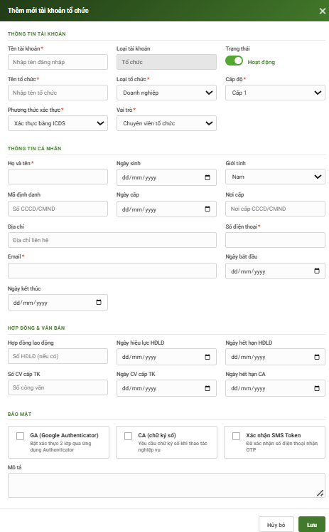

Hình 3: Màn hình thêm mới tài khoản (DSS)

#### 2.4.2. Mô tả

| STT | Thành phần | Tên (Việt) | Tên (Anh) | Bảng | Trường | Kiểm tra logic | Ràng buộc |
| --- | --- | --- | --- | --- | --- | --- | --- |
| 1 | Label | Thêm mới | New/Edit |  |  |  | Read-only. |
| 2 | Textbox | Tên tài khoản | Username | LOGINS | LOGIN_NAME | - Check trùng lặp (Unique) trong hệ thống. - Không chứa khoảng trắng | Bắt buộc nhập. |
| 3 | Dropdown | Loại tài khoản | Account type | LOGINS | LOGIN_TYPE | Cố định Loại tài khoản= “ Tổ chức “ |  |
| 5 | Dropdown | Cấp độ tài khoản | Level | LOGINS | LEVEL | Các phòng CNTT, NY, TT được tạo tất cả các tài khoản Riêng phòng trái phiếu: Level 1 Tạo & Cấp quyền: tài khoản tổ chức ( cả 3 cấp ). Level 2: Tạo & Cấp quyền: tài khoản tổ chức ( cả 3 cấp ). Level 3 : Không tạo được tài khoản, chỉ xem | Bắt buộc chọn. |
| 6 | Textbox | Tên tổ chức | Org name | LOGINS | ORG_NAME | Dạng tìm kiếm, hiện các giá trị gần giống. | Bắt buộc chọn. |
| 8 | Textbox | Họ và tên | Full name | LOGINS | FULL_NAME |  | Bắt buộc nhập. Tối đa 100 ký tự. |
| 9 | Datepicker | Ngày sinh | Date of birth | LOGINS | BIRTH_DATE | Ngày sinh < Ngày hiện tại. | Bắt buộc nhập. Format: DD/MM/YYYY. |
| 10 | Dropdown | Giới tính | Gender | LOGINS | SEX |  | Bắt buộc chọn. |
| 11 | Textbox | Mã định danh | ID number | LOGINS | RESIDENT_ID |  | Bắt buộc nhập. Chỉ chứa số/chữ cái, tối đa 20 ký tự. |
| 12 | Datepicker | Ngày cấp | Issue date | LOGINS | RESIDENT_ID_DATE | Ngày cấp <= Ngày hiện tại Ngày cấp >= Ngày sinh. | Bắt buộc nhập. |
| 13 | Textbox | Nơi cấp | Issue place | LOGINS | RESIDENT_ID_PLACE |  | Bắt buộc nhập. |
| 14 | Textbox | Địa chỉ | Address | LOGINS | ADDRESS | - | Bắt buộc nhập. |
| 15 | Textbox | Số điện thoại | Phone | LOGINS | TEL | Check trùng SĐT | Bắt buộc nhập. |
| 16 | Textbox | Email | Email | LOGINS | EMAIL | Check trùng email. | Bắt buộc nhập. |
| 17 | Datepicker | Ngày bắt đầu | Start date | LOGINS | START_DATE | Nếu có Ngày kết thúc: Ngày bắt đầu <= Ngày kết thúc. | Bắt buộc nhập. Format: DD/MM/YYYY. |
| 18 | Datepicker | Ngày kết thúc | End date | LOGINS | END_DATE | Ngày kết thúc >= Ngày bắt đầu. | Tùy chọn (Có thể bỏ trống nếu không thời hạn). |
| 19 | Textbox | Hợp đồng lao động | Labor contract no. | LOGINS | LABOR_CONTRACT |  |  |
| 20 | Datepicker | Ngày hiệu lực HĐLĐ | Contract effective date | LOGINS | LABOR_CONTRACT_START_DATE |  |  |
| 21 | Datepicker | Ngày hết hạn HĐLĐ | Contract expire date | LOGINS | LABOR_CONTRACT_END_DATE |  |  |
| 22 | Textbox | Số CV cấp TK | Approval doc no. | LOGINS | APPROVAL_DOC_NO |  |  |
| 23 | Datepicker | Ngày CV cấp TK | Approval doc date | LOGINS | APPROVAL_DOC_DATE |  |  |
| 24 | Datepicker | Ngày hết hạn CA | CA expire date | LOGINS | CA_EXPIRE_DATE |  |  |
| 25 | Checkbox/Toggle | GA (Google Authenticator) | GA flag | LOGINS | GA |  |  |
| 26 | Checkbox/Toggle | CA (chữ ký số) | CA flag | LOGINS | CA |  |  |
| 27 | Dropdown | Xác nhận SMS token | SMS token confirm | LOGINS | SMS |  |  |
| 29 | Textarea | Mô tả | Description | LOGINS | DESCRIPTION | Ghi chú thêm về việc cấp tài khoản. |  |
| 30 | Label (readonly) | Ngày đổi mật khẩu gần nhất | Last password change | LOGINS | LAST_PASS_CHANGE | Chỉ hiển thị ở màn hình Cập nhật (Edit) nếu tài khoản từng đổi mật khẩu. Ẩn khi Thêm mới. |  |
| 31 | Button | Lưu | Save |  |  | - Validate (kiểm tra logic + ràng buộc) toàn bộ các trường trước khi submit. - Trả về thông báo Thành công / Lỗi. |  |
| 32 | Button | Hủy bỏ | Cancel |  |  | Đóng form, chuyển hướng về màn hình Danh sách. Có popup cảnh báo mất dữ liệu nếu đã nhập form. |  |

Bảng 06: Mô tả màn hình "Đăng ký tài khoản (DSS)"

### 2.5. Màn hình đăng ký chuyên trang

#### 2.5.1. Màn hình

Màn đăng ký ( link gán vào DSS )

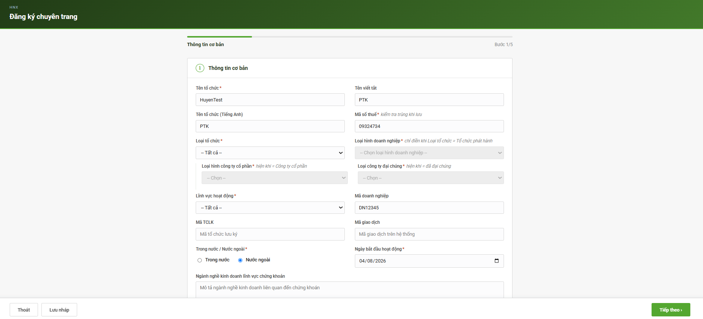

Hình 4.1: Đăng ký/ phê duyệt chuyên trang ( Bước 1: Thông tin cơ bản )

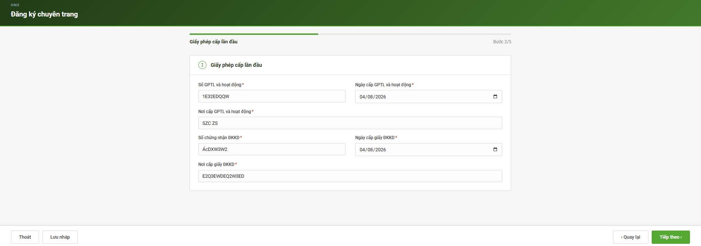

Hình 4.2: Đăng ký/ phê duyệt chuyên trang ( Bước 2: giấy phép cấp lần đầu )

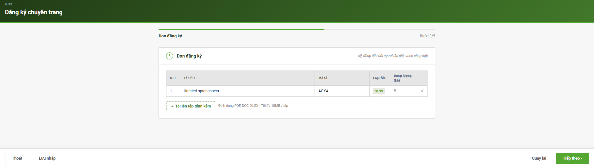

Hình 4.3: Đăng ký/ phê duyệt chuyên trang ( Bước 3: Đơn đăng ký)

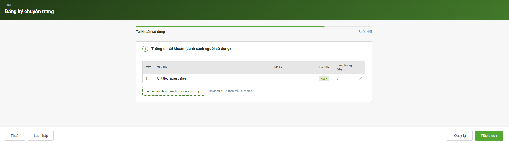

Hình 4.4: Đăng ký/ phê duyệt chuyên trang ( Bước 4: Tài khoản sử dụng)

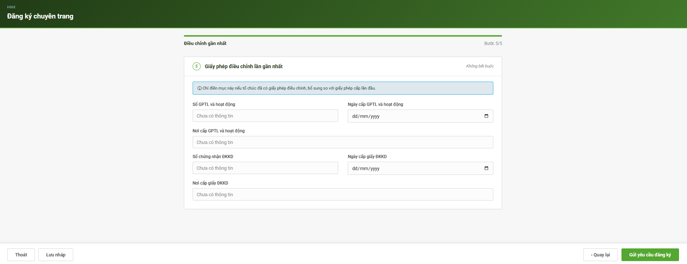

Hình 4.4: Đăng ký/ phê duyệt chuyên trang ( Bước 5: giấy phép điều chỉnh lần gần nhất)

Màn phê duyệt

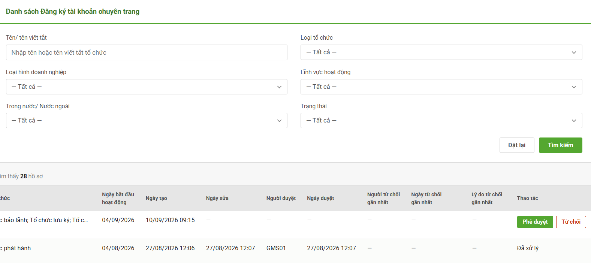

Hình 5: Phê duyệt chuyên trang IMS

#### 2.5.2. Mô tả

| STT | Thành phần | Tên (Việt) | Tên (Anh) | Bảng | Trường | Kiểm tra logic | Ràng buộc |
| --- | --- | --- | --- | --- | --- | --- | --- |
| **Màn đăng ký chuyên trang** |  |  |  |  |  |  |  |
| 1 | Input text | Tên tổ chức | Organization Name |  |  |  | Bắt buộc |
| 2 | Input text | Tên viết tắt | Short Name |  |  |  |  |
| 3 | Input text | Tên tổ chức (Tiếng Anh) | Organization Name (English) |  |  |  |  |
| 4 | Input text | Mã số thuế | Tax Code |  |  | Check trùng | Bắt buộc, đúng định dạng mã số thuế ( 10 hoặc 13 số ), không trùng |
| 5 | Dropdown | Loại tổ chức | Organization Type |  |  | 3 giá trị: tổ chức phát hành, tổ chức liên quan và khác. Sau khi phê duyệt, thông tin của phần đăng ký chuyên trang sẽ lưu dưới trạng thái “lưu tạm” trong các danh mục tổ chức. Loại danh mục tổ chức lưu thông tin hồ sơ sau phê duyệt phụ thộc vào Loại tổ chức Nếu Loại tổ chức là Tổ chức phát hành: Lưu bản ghi vào Danh mục TCPH Nếu loại tổ chức là liên quan: Lưu vào danh mục tổ chức liên quan Nếu Loại tổ chức là Tổ chức khác: lưu thông tin vào danh mục tổ chức khác | Bắt buộc |
| 6 | Dropdown | Loại hình doanh nghiệp | Enterprise Type |  |  | Chỉ cho điền khi Loại tổ chức = Tổ chức phát hành | Bắt buộc có điều kiện |
| 7 | Dropdown | Loại hình công ty cổ phần | Joint Stock Company Type |  |  | Chỉ hiện khi Loại hình DN = Công ty cổ phần | Bắt buộc có điều kiện |
| 8 | Dropdown | Loại công ty đại chúng | Public Company Type |  |  | Chỉ hiện khi Loại hình CTCP = Đã đại chúng | Bắt buộc có điều kiện |
| 9 | Dropdown | Lĩnh vực hoạt động | Business Sector |  |  |  | Bắt buộc, chọn từ danh mục |
| 10 | Input text | Mã doanh nghiệp | Enterprise Code |  |  | Check trùng | Bắt buộc,không trùng |
| 11 | Input text | Mã TCLK | Depository Org Code |  |  | Hiện khi loại tổ chức= khác | Không bắt buộc |
| 12 | Input text | Mã giao dịch | Transaction Code |  |  |  | Không bắt buộc |
| 13 | Radio | Trong nước/Nước ngoài | Domestic/Foreign |  |  | Hiện khi loại tổ chức = khác | Bắt buộc, chọn 1 giá trị |
| 14 | Textarea | Ngành nghề KD lĩnh vực chứng khoán | Securities Business Line |  |  |  | Bắt buộc nếu Lĩnh vực kinh doanh là chứng khoán |
| 15 | Date picker | Ngày bắt đầu hoạt động | Operation Start Date |  |  |  | Bắt buộc, định dạng dd/mm/yyyy |
| 16 | Input number | Vốn điều lệ | Charter Capital |  |  |  | Bắt buộc, số dương, định dạng số có phân tách hàng nghìn |
| 17 | Input text | Địa chỉ trụ sở | Head Office Address |  |  |  | Bắt buộc |
| 18 | Input email | Email | Email |  |  | Kiểm tra định dạng email, check trùng | Bắt buộc, đúng định dạng email, check trùng |
| 19 | Input tel | Số điện thoại | Phone Number |  |  | Kiểm tra định dạng số điện thoại, check trùng | Bắt buộc, chỉ nhập số, check trùng |
| 20 | Input text | Fax | Fax |  |  |  | Không bắt buộc |
| 21 | Input text | Người đại diện theo pháp luật | Legal Representative |  |  |  | Bắt buộc |
| 22 | Input tel | Điện thoại (người đại diện) | Representative Phone |  |  | Kiểm tra định dạng số điện thoại | Bắt buộc |
| 23 | Input email | Email (người đại diện) | Representative Email |  |  | Kiểm tra định dạng email | Bắt buộc |
| 24 | Input text | Người được ủy quyền CBTT | Authorized Disclosure Person |  |  |  |  |
| 25 | Input tel | Điện thoại (ủy quyền) | Authorized Person Phone |  |  | Kiểm tra định dạng số đth |  |
| 26 | Input email | Email (ủy quyền) | Authorized Person Email |  |  | Kiểm tra định dạng email |  |
| 27 | Input text | Số GPTL và hoạt động (lần đầu) | Initial License Number |  |  |  | Bắt buộc |
| 28 | Date picker | Ngày cấp GPTL và hoạt động (lần đầu) | Initial License Issue Date |  |  |  | Bắt buộc |
| 29 | Input text | Nơi cấp GPTL và hoạt động (lần đầu) | Initial License Issued By |  |  |  | Bắt buộc |
| 30 | Input text | Số chứng nhận ĐKKD (lần đầu) | Initial Business Reg. No. |  |  |  | Bắt buộc |
| 31 | Date picker | Ngày cấp giấy ĐKKD (lần đầu) | Initial Business Reg. Date |  |  |  | Bắt buộc |
| 32 | Input text | Nơi cấp giấy ĐKKD (lần đầu) | Initial Business Reg. Issued By |  |  |  | Bắt buộc |
| 33 | File upload | Đơn đăng ký (STT, Tên file, Mô tả, Loại file, Dung lượng) | Registration Form File |  |  |  | Bắt buộc, phải ký đóng dấu bởi người đại diện pháp luật; định dạng… |
| 34 | File upload | Danh sách người sử dụng (STT, Tên file, Mô tả, Loại file, Dung lượng) | User List File |  |  |  | Bắt buộc, theo mẫu quy định |
| 35 | Input text | Số GPTL và hoạt động (điều chỉnh) | Adjusted License Number |  |  |  | Bắt buộc |
| 36 | Date picker | Ngày cấp GPTL và hoạt động (điều chỉnh) | Adjusted License Issue Date |  |  |  | Bắt buộc |
| 37 | Input text | Nơi cấp GPTL và hoạt động (điều chỉnh) | Adjusted License Issued By |  |  |  | Bắt buộc |
| 38 | Input text | Số chứng nhận ĐKKD (điều chỉnh) | Adjusted Business Reg. No. |  |  |  | Bắt buộc |
| 39 | Date picker | Ngày cấp giấy ĐKKD (điều chỉnh) | Adjusted Business Reg. Date |  |  |  | Bắt buộc |
| 40 | Input text | Nơi cấp giấy ĐKKD (điều chỉnh) | Adjusted Business Reg. Issued By |  |  |  | Bắt buộc |
| **Danh sách phê duyệt** |  |  |  |  |  |  |  |
| 1 | Column | STT | No. |  |  |  |  |
| 2 | Column | Tên tổ chức | Organization Name |  |  | Hiển thị theo giá trị đã lưu khi tạo/cập nhật |  |
| 3 | Column | Tên viết tắt | Short Name |  |  | Hiển thị theo giá trị đã lưu |  |
| 4 | Column | Mã số thuế | Tax Code |  |  |  |  |
| 5 | Column | Trong nước/ Nước ngoài | Domestic/Foreign |  |  |  |  |
| 6 | Column | Trạng thái | Status |  |  | 2 trạng thái: phê duyệt hoặc từ chối Nếu phê duyệt, trạng thái hiện: “Đã phê duyệt “ Nếu từ chối, hệ thống hiện “ đã từ chối “ Lý do từ chối sẽ được gửi về email của tổ chức và email người đại diện pháp luật tổ chức |  |
| 7 | Column | Loại tổ chức | Organization Type |  |  | Hiển thị theo lựa chọn khi tạo mới |  |
| 8 | Column | Ngày bắt đầu hoạt động | Operation Start Date |  |  | Hiển thị theo giá trị đã nhập khi tạo mới |  |
| 9 | Column | Ngày tạo | Created Date |  |  | Hệ thống tự sinh khi tạo mới bản ghi | Read-only; định dạng dd/mm/yyyy |
| 10 | Column | Ngày sửa | Updated Date |  |  | Hệ thống tự cập nhật mỗi lần chỉnh sửa | Read-only; định dạng dd/mm/yyyy |
| 11 | Column | Người duyệt | Approved By |  |  | Chỉ có giá trị khi Trạng thái = Đã duyệt | Read-only; hệ thống tự ghi theo tài khoản người thực hiện duyệt |
| 12 | Column | Ngày duyệt | Approved Date |  |  | Chỉ có giá trị khi Trạng thái = Đã duyệt | Read-only; định dạng dd/mm/yyyy |
| 13 | Column | Người từ chối | Last Rejected By |  |  | Chỉ có giá trị khi Trạng thái = Đã từ chối | Read-only; hệ thống tự ghi theo tài khoản người từ chối |
| 14 | Column | Ngày từ chối | Last Rejected Date |  |  | Chỉ có giá trị khi Trạng thái = Đã từ chối | Read-only; định dạng dd/mm/yyyy |
| 15 | Column | Lý do từ chối | Last Reject Reason |  |  | Do người duyệt nhập khi thực hiện từ chối | Bắt buộc nhập khi thực hiện thao tác Từ chối |
| 16 | Button/Icon | Thao tác | Action |  |  | Hiển thị nút thao tác: từ chối- phê duyệt Sau khi click phê duyệt hoặc từ chối: liên kết đến trang chi tiết bản ghi để chỉnh sửa thông tin rồi mới ấn nút phê duyệt/ từ chối. Nếu từ chối, cần ghi lý do từ chối, mail sẽ gửi gửi về email của tổ chức hoặc email người đại diện pl tổ chức. Nếu phê duyệt, email phê duyệt cũng sẽ được gửi đến email của 2 người dùng trên, kèm thông báo “ thông tin tài khoản sẽ được gửi sau” | Xem/Sửa/Duyệt/Từ chối/Xóa đều ghi log vào USER_AUDIT_LOG |
| **Màn chỉnh sửa chi tiết để phê duyệt/ từ chối đăng ký chuyên trang** |  |  |  |  |  |  |  |
| 1 | Input text | Tên tổ chức | Organization Name |  |  |  | Bắt buộc |
| 2 | Input text | Tên viết tắt | Short Name |  |  |  |  |
| 3 | Input text | Tên tổ chức (Tiếng Anh) | Organization Name (English) |  |  |  |  |
| 4 | Input text | Mã số thuế | Tax Code |  |  | Check trùng | Bắt buộc, đúng định dạng mã số thuế ( 10 hoặc 13 số ), không trùng |
| 5 | Dropdown | Loại tổ chức | Organization Type |  |  | Sau khi phê duyệt, thông tin của phần đăng ký chuyên trang sẽ lưu dưới trạng thái “lưu tạm” trong các danh mục tổ chức. Loại danh mục tổ chức lưu thông tin hồ sơ sau phê duyệt phụ thộc vào Loại tổ chức Nếu Loại tổ chức là Tổ chức phát hành: Lưu bản ghi vào Danh mục TCPH Nếu loại tổ chức là Tổ chức lưu ký: Lưu vào danh mục Quản lý thành viên Nếu loại tổ chức là ĐT, BL, PH: lưu vào danh mục ĐT, BL, PH Nếu Loại tổ chức là Tổ chức đại diện người sở hữu | Bắt buộc |
| 6 | Dropdown | Loại hình doanh nghiệp | Enterprise Type |  |  | Chỉ cho điền khi Loại tổ chức = Tổ chức phát hành | Bắt buộc có điều kiện |
| 7 | Dropdown | Loại hình công ty cổ phần | Joint Stock Company Type |  |  | Chỉ hiện khi Loại hình DN = Công ty cổ phần | Bắt buộc có điều kiện |
| 8 | Dropdown | Loại công ty đại chúng | Public Company Type |  |  | Chỉ hiện khi Loại hình CTCP = Đã đại chúng | Bắt buộc có điều kiện |
| 9 | Dropdown | Lĩnh vực hoạt động | Business Sector |  |  |  | Bắt buộc, chọn từ danh mục |
| 10 | Input text | Mã doanh nghiệp | Enterprise Code |  |  | Check trùng | Bắt buộc,không trùng |
| 11 | Input text | Mã TCLK | Depository Org Code |  |  |  | Không bắt buộc |
| 12 | Input text | Mã giao dịch | Transaction Code |  |  |  | Không bắt buộc |
| 13 | Radio | Trong nước/Nước ngoài | Domestic/Foreign |  |  |  | Bắt buộc, chọn 1 giá trị |
| 14 | Textarea | Ngành nghề KD lĩnh vực chứng khoán | Securities Business Line |  |  |  | Bắt buộc nếu Lĩnh vực kinh doanh là chứng khoán |
| 15 | Date picker | Ngày bắt đầu hoạt động | Operation Start Date |  |  |  | Bắt buộc, định dạng dd/mm/yyyy |
| 16 | Input number | Vốn điều lệ | Charter Capital |  |  |  | Bắt buộc, số dương, định dạng số có phân tách hàng nghìn |
| 17 | Input text | Địa chỉ trụ sở | Head Office Address |  |  |  | Bắt buộc |
| 18 | Input email | Email | Email |  |  | Kiểm tra định dạng email, check trùng Sau khi phê duyệt, thông tin phê duyệt sẽ được gửi vào email này, kèm thông báo sẽ có tài khoản đăng nhập sau đó. Nếu từ chối, lý do từ chối sẽ được gửi vào email này, kèm 1 đường link dẫn đến trang Đăng ký chuyên trang ( với các thông tin họ đã đăng ký trước đó ) | Bắt buộc, đúng định dạng email, check trùng |
| 19 | Input tel | Số điện thoại | Phone Number |  |  | Kiểm tra định dạng số điện thoại, check trùng | Bắt buộc, chỉ nhập số, check trùng |
| 20 | Input text | Fax | Fax |  |  |  | Không bắt buộc |
| 21 | Input text | Người đại diện theo pháp luật | Legal Representative |  |  |  | Bắt buộc |
| 22 | Input tel | Điện thoại (người đại diện) | Representative Phone |  |  | Kiểm tra định dạng số điện thoại | Bắt buộc |
| 23 | Input email | Email (người đại diện) | Representative Email |  |  | Kiểm tra định dạng email Sau khi phê duyệt, thông tin phê duyệt sẽ được gửi vào email này, kèm thông báo sẽ có tài khoản đăng nhập sau đó. Nếu từ chối, lý do từ chối sẽ được gửi vào email này, kèm 1 đường link dẫn đến trang Đăng ký chuyên trang ( với các thông tin họ đã đăng ký trước đó ) | Bắt buộc |
| 24 | Input text | Người được ủy quyền CBTT | Authorized Disclosure Person |  |  |  |  |
| 25 | Input tel | Điện thoại (ủy quyền) | Authorized Person Phone |  |  | Kiểm tra định dạng số đth |  |
| 26 | Input email | Email (ủy quyền) | Authorized Person Email |  |  | Kiểm tra định dạng email |  |
| 27 | Input text | Số GPTL và hoạt động (lần đầu) | Initial License Number |  |  |  | Bắt buộc |
| 28 | Date picker | Ngày cấp GPTL và hoạt động (lần đầu) | Initial License Issue Date |  |  |  | Bắt buộc |
| 29 | Input text | Nơi cấp GPTL và hoạt động (lần đầu) | Initial License Issued By |  |  |  | Bắt buộc |
| 30 | Input text | Số chứng nhận ĐKKD (lần đầu) | Initial Business Reg. No. |  |  |  | Bắt buộc |
| 31 | Date picker | Ngày cấp giấy ĐKKD (lần đầu) | Initial Business Reg. Date |  |  |  | Bắt buộc |
| 32 | Input text | Nơi cấp giấy ĐKKD (lần đầu) | Initial Business Reg. Issued By |  |  |  | Bắt buộc |
| 33 | File upload | Đơn đăng ký (STT, Tên file, Mô tả, Loại file, Dung lượng) | Registration Form File |  |  |  | Bắt buộc, phải ký đóng dấu bởi người đại diện pháp luật; định dạng… |
| 34 | File upload | Danh sách người sử dụng (STT, Tên file, Mô tả, Loại file, Dung lượng) | User List File |  |  |  | Bắt buộc, theo mẫu quy định |
| 35 | Input text | Số GPTL và hoạt động (điều chỉnh) | Adjusted License Number |  |  |  | Bắt buộc |
| 36 | Date picker | Ngày cấp GPTL và hoạt động (điều chỉnh) | Adjusted License Issue Date |  |  |  | Bắt buộc |
| 37 | Input text | Nơi cấp GPTL và hoạt động (điều chỉnh) | Adjusted License Issued By |  |  |  | Bắt buộc |
| 38 | Input text | Số chứng nhận ĐKKD (điều chỉnh) | Adjusted Business Reg. No. |  |  |  | Bắt buộc |
| 39 | Date picker | Ngày cấp giấy ĐKKD (điều chỉnh) | Adjusted Business Reg. Date |  |  |  | Bắt buộc |
| 40 | Input text | Nơi cấp giấy ĐKKD (điều chỉnh) | Adjusted Business Reg. Issued By |  |  |  | Bắt buộc |

Bảng 07: Mô tả màn hình "Phê duyệt tài khoản (bên ngoài)"

### 2.6. Màn hình Reset mật khẩu

#### 2.6.1. Màn hình

Reset mật khẩu cho người dùng khác ( Popup reset mật khẩu hiển thị khi click vào button Reset mật khẩu (5) trong Danh sách tài khoản ở IMS và DSS)

Luồng:

Admin click vào button (5) Reset mật khẩu rồi chọn 2 phương án

1. Tự điền mật khẩu: Admin tự điền mật khẩu và chọn gửi hoặc không gửi email cho người nhận

2. (Mặc định ): Tự động sinh mật khẩu, người dùng chỉ kiểm tra email đích trước khi gửi

Admin click gửi mật khẩu

Người nhận lấy thông tin mật khẩu từ Email rồi thực hiện đổi mật khẩu khi đăng nhập lần đầu tiên sau khi có mật khẩu mới

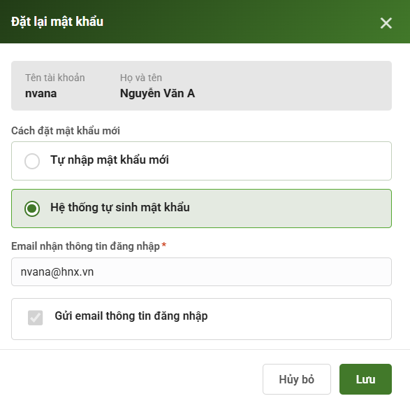

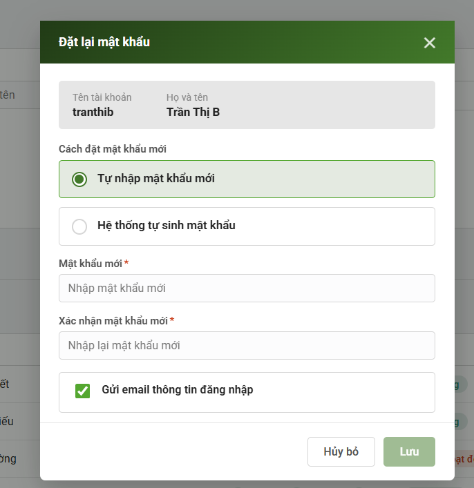

Màn hình 6.1: Tạo mật khẩu mới cho người dùng

Tự reset mật khẩu ( Popup reset mật khẩu hiển thị khi click vào button “ đổi mật khẩu” trong profile cá nhân  )

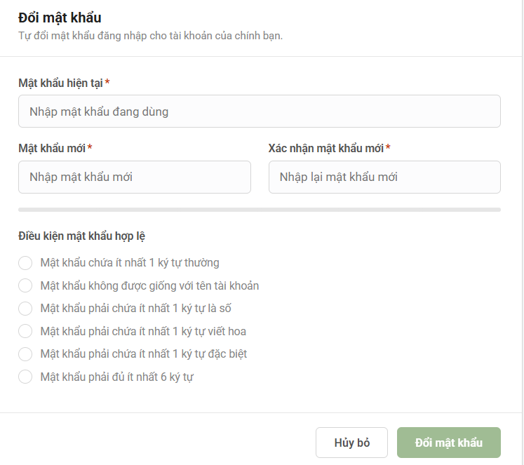

Màn hình 6.2: Người dùng tự đặt lại mật khẩu

| STT | Thành phần | Tên (Việt) | Tên (Anh) | Bảng | Trường | Kiểm tra logic | Ràng buộc |
| --- | --- | --- | --- | --- | --- | --- | --- |
| **Reset mật khẩu cho người dùng khác** |  |  |  |  |  |  |  |
| **1.1. Admin tự điền mật khẩu mới** |  |  |  |  |  |  |  |
| 1 | Text hiển thị (readonly) | Tên tài khoản | Username | LOGINS | LOGIN_NAME |  | Lấy theo tài khoản đang chọn |
| 2 | Text hiển thị (readonly) | Họ và tên | Full Name | LOGINS | FULL_NAME |  | Lấy theo tài khoản đang chọn |
| 3 | Input password | Mật khẩu mới | New Password |  |  |  | Bắt buộc |
| 4 | Input password | Xác nhận mật khẩu mới | Confirm New Password |  |  | Kiểm tra khớp tuyệt đối với "Mật khẩu mới" | Bắt buộc, phải giống hệt Mật khẩu mới |
| 5 | Button | Hủy bỏ | Cancel |  |  | Không kiểm tra | Đóng popup, không lưu log |
| 6 | Button | Lưu | Save |  |  | Chỉ kích hoạt khi cả 2 trường mật khẩu hợp lệ và khớp nhau | Bắt buộc điền đủ và đúng 2 trường mật khẩu; sau khi lưu: vô hiệu hóa mật khẩu cũ ngay lập tức, mật khẩu mới dùng được ngay, ghi nhận thao tác vào USER_AUDIT_LOG |
| **1.2. Hệ thống tự sinh mật khẩu** |  |  |  |  |  |  |  |
| 7 | Text hiển thị (readonly) | Tên tài khoản | Username | LOGINS | LOGIN_NAME |  | Lấy theo tài khoản đang chọn |
| 8 | Text hiển thị (readonly) | Họ và tên | Full Name | LOGINS | FULL_NAME |  | Lấy theo tài khoản đang chọn |
| 9 | Texttbox | Email | Email | LOGINS | Email |  | Bắt buộc, giá trị mặc định lấy từ bảng Logins, tuy nhiên có thể thay đổi |
| 10 | Button | Hủy bỏ | Cancel |  |  | Không kiểm tra | Đóng popup, không lưu log |
| 11 | Button | Lưu | Save |  |  | Chỉ kích hoạt khi cả 2 trường mật khẩu hợp lệ và khớp nhau | Bắt buộc điền đủ và đúng 2 trường mật khẩu; sau khi lưu: vô hiệu hóa mật khẩu cũ ngay lập tức, mật khẩu mới dùng được ngay, ghi nhận thao tác vào USER_AUDIT_LOG |
| 12 | Input password | Xác nhận mật khẩu mới | Confirm New Password |  |  | Kiểm tra khớp tuyệt đối với "Mật khẩu mới" | Bắt buộc, phải giống hệt Mật khẩu mới |
| 13 | Button | Hủy bỏ | Cancel |  |  | Không kiểm tra | Đóng popup, không lưu log |
| 14 | Button | Lưu | Save |  |  | Chỉ kích hoạt khi cả 2 trường mật khẩu hợp lệ và khớp nhau | Bắt buộc điền đủ và đúng 2 trường mật khẩu; sau khi lưu: vô hiệu hóa mật khẩu cũ ngay lập tức, mật khẩu mới dùng được ngay, ghi nhận thao tác vào USER_AUDIT_LOG |

2.7. Màn hình Thay đổi mật khẩu lần đầu

#### 2.7.1. Màn hình

Thay đổi mật khẩu lần đầu ( Sau khi có email tên tài khoản và mật khẩu gửi về email, người dùng đăng nhập lần đầu sẽ phải đổi lại mật khẩu với policy hiển thị như dưới)

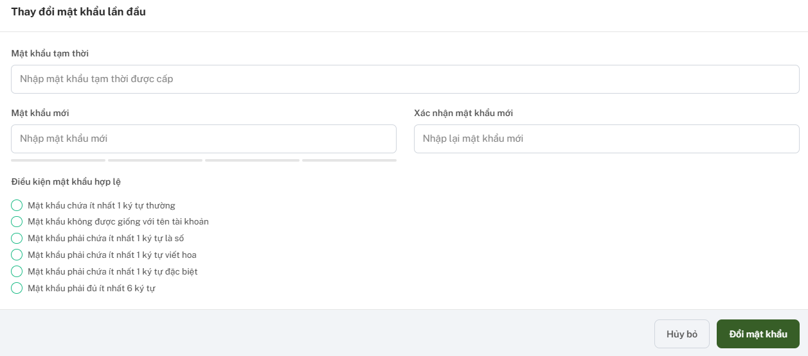

Màn hình 7: Thay đổi mật khẩu lần đầu

#### 2.6.2. Mô tả

| STT | Thành phần | Tên (Việt) | Tên (Anh) | Bảng | Trường | Kiểm tra logic | Ràng buộc |
| --- | --- | --- | --- | --- | --- | --- | --- |
| 1 | Input password | Mật khẩu tạm thời | Temporary Password |  |  | Kiểm tra khớp với mật khẩu tạm thời đã cấp cho tài khoản | Bắt buộc, phải đúng mật khẩu tạm thời hệ thống đã cấp |
| 2 | Input password | Mật khẩu mới | New Password |  |  | Đánh giá real-time theo 6 điều kiện hợp lệ bên dưới (thanh progress đổi màu theo số điều kiện đạt) | Bắt buộc, phải thỏa toàn bộ 6 điều kiện mật khẩu hợp lệ |
| 3 | Input password | Xác nhận mật khẩu mới | Confirm New Password |  |  | Kiểm tra khớp tuyệt đối với "Mật khẩu mới" | Bắt buộc, phải giống hệt Mật khẩu mới |
| 4 | Thanh đánh giá độ mạnh (progress bar) | Mức độ đáp ứng điều kiện mật khẩu | Password strength indicator |  |  | Tính theo số điều kiện trong danh sách 6 điều kiện đã đạt | Chỉ hiển thị, không phải trường nhập liệu |
| 5 | Checklist điều kiện (radio/check theo từng dòng) | Mật khẩu chứa ít nhất 1 ký tự thường | Contains at least 1 lowercase letter |  |  | Regex kiểm tra tồn tại ít nhất 1 ký tự [a-z] trong Mật khẩu mới | Điều kiện bắt buộc để mật khẩu hợp lệ |
| 6 | Checklist điều kiện | Mật khẩu không được giống với tên tài khoản | Must not match username |  |  | So sánh (không phân biệt hoa/thường) giá trị Mật khẩu mới với Tên tài khoản đăng nhập | Điều kiện bắt buộc để mật khẩu hợp lệ |
| 7 | Checklist điều kiện | Mật khẩu phải chứa ít nhất 1 ký tự là số | Contains at least 1 digit |  |  | kiểm tra tồn tại ít nhất 1 ký tự [0-9] trong Mật khẩu mới | Điều kiện bắt buộc để mật khẩu hợp lệ |
| 8 | Checklist điều kiện | Mật khẩu phải chứa ít nhất 1 ký tự viết hoa | Contains at least 1 uppercase letter |  |  | Regex kiểm tra tồn tại ít nhất 1 ký tự [A-Z] trong Mật khẩu mới | Điều kiện bắt buộc để mật khẩu hợp lệ |
| 9 | Checklist điều kiện | Mật khẩu phải chứa ít nhất 1 ký tự đặc biệt | Contains at least 1 special character |  |  | Regex kiểm tra tồn tại ít nhất 1 ký tự đặc biệt (!@#$%...) trong Mật khẩu mới | Điều kiện bắt buộc để mật khẩu hợp lệ |
| 10 | Checklist điều kiện | Mật khẩu phải đủ ít nhất 8 ký tự | Minimum length of 8 characters |  |  | Kiểm tra độ dài chuỗi Mật khẩu mới ≥ 8 | Điều kiện bắt buộc để mật khẩu hợp lệ |
| 11 | Button | Hủy bỏ | Cancel |  |  | Không kiểm tra | Đóng màn hình, không đổi mật khẩu, có thể yêu cầu xác nhận trước khi thoát |
| 12 | Button | Đổi mật khẩu | Change Password |  |  | Chỉ kích hoạt khi: Mật khẩu tạm thời đúng, cả 6 điều kiện đạt, và Xác nhận mật khẩu khớp | Bắt buộc thỏa toàn bộ điều kiện; sau khi đổi thành công: đánh dấu tài khoản đã đổi mật khẩu lần đầu, ghi log vào USER_AUDIT_LOG, chuyển vào hệ thống |

2.8. Màn Widget thông báo nhắc phê duyệt hồ sơ và tạo tài khoản

#### 2.8.1. Màn hình

Widget thông báo nhắc phê duyệt hồ sơ và tạo tài khoản là 1 khối nhỏ trong Màn hình “ Trang chủ” , sử dụng để hiển thị cảnh báo, nhắc tạo tài khoản sau khi đã lưu hồ sơ tổ chức ( phát hành, liên quan, khác,.. ) và nhắc phê duyệt đăng ký chuyên trang

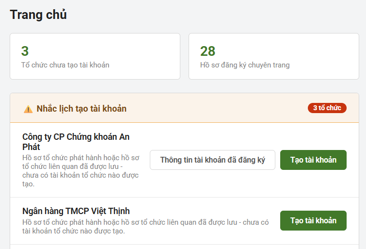

Màn hình 08: Widget thông báo nhắc phê duyệt hồ sơ và tạo tài khoản

#### 2.8.2. Mô tả

| STT | Thành phần | Tên (Việt) | Tên (Anh) | Bảng | Trường | Kiểm tra logic | Ràng buộc |
| --- | --- | --- | --- | --- | --- | --- | --- |
| 2 | Thẻ số liệu | Tổ chức chưa tạo tài khoản | Organizations pending account creation | Bảng hồ sơ tổ chức ( phát hành, liên quan, khác ) |  | Đếm số tổ chức có Trạng thái = 'Đã lưu' nhưng chưa có bản ghi tương ứng trong LOGINS | Readonly, chỉ hiển thị |
| 3 | Thẻ số liệu | Hồ sơ đăng ký chuyên trang | Registered profiles | Bảng đăng ký chuyên trang |  | Đếm tổng số bản ghi trong bảng hồ sơ tổ chức có tình trạng = chưa xử lý | Readonly, chỉ hiển thị |
| 5 | Tiêu đề khối cảnh báo | Nhắc lịch tạo tài khoản | Account creation reminder |  |  | Hiển thị khi có ít nhất 1 tổ chức thỏa điều kiện ở mục 1 | Readonly, có icon cảnh báo ⚠ |
| 7 | Text hiển thị | Tên tổ chức (từng dòng nhắc lịch) | Organization name | Bảng hồ sơ tổ chức ( phát hành, liên quan, khác ) |  | Chỉ lấy tổ chức thỏa điều kiện ở mục 2 | Readonly |
| 8 | Text hiển thị | Ghi chú trạng thái hồ sơ | Profile status note | Bảng hồ sơ tổ chức ( phát hành, liên quan, khác ) |  | Nội dung cố định: "Hồ sơ tổ chức phát hành hoặc hồ sơ tổ chức liên quan ( ăn theo trường Loại tổ chức trong Bảng Hồ sơ ) đã được lưu - chưa có tài khoản tổ chức nào được tạo." | Readonly, hiển thị với mọi dòng trong danh sách |
| 9 | Button | Thông tin tài khoản đã đăng ký | Registered account info | Bảng hồ sơ tổ chức ( phát hành, liên quan, khác ) |  | Chỉ hiển thị khi tổ chức có đính kèm file danh sách tài khoản lúc đăng ký chuyên trang; nếu hồ sơ được admin tự thêm mới ( không có thông tin tài khoản cá nhân đi kèm ) thì ẩn nút | Không bắt buộc, nếu có bấm vào sẽ mở file đã đính kèm |
| 10 | Button | Tạo tài khoản | Create account |  |  | Điều hướng sang màn Quản lý tài khoản để khởi tạo tài khoản tổ chức cho dòng đang chọn | Luôn hiển thị, cố định vị trí ngoài cùng bên phải ở mọi dòng; sau khi tạo thành công dòng tự biến mất khỏi danh sách |

## 3. Luồng dữ liệu (Data Flow Diagram)

### 3.1. Thành phần

| Loại | Mô tả |
| --- | --- |
| Tiến trình xử lý (process) | P1: Quản lý tài khoản (CRUD) — tìm kiếm, thêm mới, chỉnh sửa, khóa/mở |
|  | P2: Phê duyệt tài khoản — xử lý yêu cầu đăng ký tài khoản bên ngoài |
|  | P3: Xác thực / SSO / GA-CA — xác thực đăng nhập, cấp quyền qua SSO, kiểm tra GA/CA |
|  | P4: Ghi log hệ thống — ghi nhận thao tác vào USER_AUDIT_LOG |
| Dữ liệu (storage) | LOGINS: Bảng lưu thông tin tài khoản |
|  | ORGANIZATION_PROFILE: Bảng danh mục đơn vị/tổ chức |
|  | PERMISSION_ACCESS: Bảng quyền truy cập |
|  | USER_AUDIT_LOG: Bảng nhật ký thao tác người dùng |
| Hành động (activity) | Call, Insert, Update, Delete (soft), Query, Response |

Bảng 08: Thành phần luồng dữ liệu

## 4. Mô tả dữ liệu (Data Dictionary)

### 4.1. Bảng LOGINS

| No | Field | Type | Length | Null? | PK | FK | Default | Description |
| --- | --- | --- | --- | --- | --- | --- | --- | --- |
| 1 | ID | NUMBER(10,0) |  | N | x |  |  | Khóa chính |
| 2 | LOGIN_NAME | VARCHAR2(50) | 50 | N |  |  |  | Tên đăng nhập — key check trùng với hệ thống CBIS |
| 3 | TYPE | VARCHAR2(20) | 20 | N |  |  |  | Cổ phiếu/Trái phiếu/UBND/UBCK/Nhà đầu tư/Lưu ký/Đấu thầu/Bảo lãnh/ĐLPH |
| 4 | ORGANIZATION_ID |  |  |  |  |  |  | FK |
| 4 | FULLNAME | NVARCHAR2(200) | 200 | N |  |  |  | Họ và tên |
| 5 | ORG_NAME | NVARCHAR2(200) | 200 | Y |  | x |  | Tên tổ chức |
| 6 | DEPARTMENT | VARCHAR2(50) | 50 | Y |  |  |  | Niêm yết/Trái phiếu/Thị trường (áp dụng tài khoản nội bộ) |
| 7 | CONTRACT | VARCHAR2(30) | 30 | Y |  |  |  | Số hợp đồng lao động |
| 8 | CONTRACT_START_DATE | DATE |  | Y |  |  |  | Ngày hiệu lực HĐLĐ |
| 9 | CONTRACT_END_DATE | DATE |  | Y |  |  |  | Ngày hết hạn HĐLĐ |
| 10 | BIRTH | DATE |  | Y |  |  |  | Ngày sinh |
| 11 | IDENTIFICATION_NO | VARCHAR2(20) | 20 | Y |  |  |  | Số CCCD/CMND |
| 12 | IDENTIFICATION_DATE | DATE |  | Y |  |  |  | Ngày cấp CCCD/CMND |
| 13 | IDENTIFICATION_PLACE | NVARCHAR2(200) | 200 | Y |  |  |  | Nơi cấp |
| 14 | ADDRESS | NVARCHAR2(500) | 500 | Y |  |  |  | Địa chỉ |
| 15 | PHONE | VARCHAR2(15) | 15 | Y |  |  |  | Số điện thoại |
| 16 | EMAIL | VARCHAR2(100) | 100 | N |  |  |  | Email |
| 17 | GENDER | NUMBER(1,0) |  | Y |  |  |  | Giới tính (0: Nữ, 1: Nam) |
| 18 | START_DATE | DATE |  | Y |  |  |  | Ngày bắt đầu hiệu lực tài khoản |
| 19 | END_DATE | DATE |  | Y |  |  |  | Ngày kết thúc hiệu lực tài khoản |
| 20 | STATUS | NUMBER(1,0) |  | N |  |  | 1 | 1: Hoạt động, 0: Ngừng hoạt động, 2: Chờ duyệt, 3: Từ chối |
| 21 | APPROVAL_DOC_NO | VARCHAR2(30) | 30 | Y |  |  |  | Số công văn cấp tài khoản |
| 22 | APPROVAL_DOCUMENT_DATE | DATE |  | Y |  |  |  | Ngày công văn cấp tài khoản |
| 23 | GA | NUMBER(1,0) |  | Y |  |  | 0 | Bật/tắt Google Authenticator |
| 24 | SMS | NUMBER(1,0) |  | Y |  |  | 0 | Xác nhận SMS token |
| 25 | CA | NUMBER(1,0) |  | Y |  |  | 0 | Trạng thái sử dụng chữ ký số CA |
| 26 | CA_EXPIRY_DATE | DATE |  | Y |  |  |  | Ngày hết hạn chữ ký số CA (không bắt buộc) |
| 27 | DESCRIPTION | NVARCHAR2(500) | 500 | Y |  |  |  | Mô tả |
| 28 | LAST_PASSWORD_CHANGED_DATE | DATE |  | Y |  |  |  | Ngày đổi mật khẩu gần nhất |
| 29 | CREATED_BY | VARCHAR2(30) | 30 | Y |  |  |  | Người tạo |
| 30 | CREATED_DATE | DATE |  | Y |  |  |  | Ngày tạo |
| 31 | UPDATED_BY | VARCHAR2(30) | 30 | Y |  |  |  | Người sửa |
| 32 | UPDATED_DATE | DATE |  | Y |  |  |  | Ngày sửa |
| 33 | DELETE_FLG | NUMBER(1,0) |  | N |  |  | 0 |  |
| 34 | ROLE |  |  |  |  |  |  | Vai trò |
| 35 | PROVINCE |  |  |  |  |  |  | Tỉnh thành |

### 4.2. Bảng ORGANIZATION_PROFILE

### 4.5. ERD

Hình 05: Sơ đồ quan hệ dữ liệu (ERD) — ký hiệu crow's foot

## 5. Thiết kế API

### 5.1. Tổng quan

| Mục | Nội dung |
| --- | --- |
| Service name | IAM Service (mã: IAM-SERVICE) |
| Base URL | api/iam/accounts (đề xuất — cần xác nhận với đội Platform) |
| Header - Authentication | OIDC/JWT do IAM Service cấp — xác thực qua Identity Provider chung của hệ thống (Platform IAM/Keycloak) |
| Header - Content-Type | application/json |
| Header - Accept-Language | vi (hoặc en) |
| Giao tiếp | Frontend (IMS-UI/DSS-UI, Angular) gọi Middleware qua REST API · JSON · JWT; nội bộ giữa các service trong Middleware qua REST API dùng Kubernetes Service (svc). |
| Description | Cung cấp API quản lý tài khoản người dùng (CRUD, phân quyền, đổi trạng thái), đăng ký/phê duyệt tài khoản bên ngoài, và xác thực SSO. |

Bảng 13: Tổng quan thiết kế API

### 5.2. Danh sách API

| API | Method | Version | Mô tả |
| --- | --- | --- | --- |
| /accounts/search | POST | v1 | Tìm kiếm/lấy danh sách tài khoản có phân trang, kết hợp điều kiện AND |
| /accounts/{id} | GET | v1 | Lấy thông tin chi tiết tài khoản |
| /accounts | POST | v1 | Thêm mới tài khoản nội bộ |
| /accounts/{id} | PUT | v1 | Cập nhật thông tin tài khoản |
| /accounts/{id}/status | PUT | v1 | Kích hoạt/Ngừng kích hoạt/Khóa/Mở lại tài khoản |
| /accounts/{id}/roles | PUT | v1 | Phân quyền/gán vai trò cho tài khoản |
| /accounts/register | POST | v1 | Đăng ký tài khoản bên ngoài (DSS) — Admin tổ chức/Chuyên viên tổ chức |
| /accounts/{id}/approve | PUT | v1 | Phê duyệt yêu cầu đăng ký tài khoản bên ngoài |
| /accounts/{id}/reject | PUT | v1 | Từ chối yêu cầu đăng ký tài khoản bên ngoài |
| /accounts/{id}/reset-password | POST | v1 | Reset mật khẩu, gửi thông tin xác thực mới qua Email/SMS |
| /accounts/{id}/sessions | GET | v1 | Lấy danh sách phiên đăng nhập của tài khoản |
| /accounts/{id}/sessions/{sessionId} | DELETE | v1 | Kết thúc (thu hồi) một phiên đăng nhập |
| /auth/sso/login | POST | v1 | Xác thực đăng nhập và cấp token SSO cho các hệ thống tích hợp |

Bảng 14: Danh sách API
